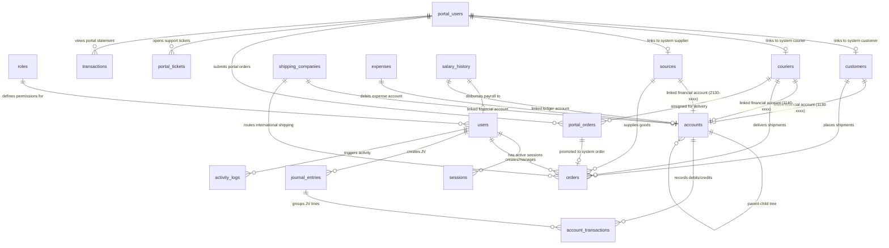

# 📘 الدليل المرجعي وقاموس جداول قاعدة البيانات وخريطة العلاقات الشاملة (Database Dictionary & ERD Map)
## نظام swiftship الأصلي + موقع الويب والبوابات الخارجية (ALX Web Portal)

---

> [!IMPORTANT]
> تحتوي هذه الوثيقة المرجعية الشاملة على القاموس الكامل والمفصل لجميع جداول قاعدة البيانات الـ 23 في نظام **swiftship** وموقع الويب **ALX Web Portal**، بما في ذلك أسماء الحقول، أنواع البيانات، القيود، الشرح الوظيفي لكل حقل، وخريطة شبكة العلاقات والمفاتيح الأجنبية (Foreign Keys) والروابط بين الجداول بالنظام الأصلي وبوابة الويب.

---

# 1. مخطط شبكة العلاقات بين الجداول (Entity Relationship Diagram - ERD)

---

# 2. قاموس جداول النظام الأصلي (`swiftship` Core System Tables)

---

## 2.1 جدول `users` (المستخدمين والمسؤولين للنظام الأصلي)
* **الوصف**: يخزن حسابات موظفي وإداريي الشركة المصرح لهم بالدخول للنظام الأصلي مع تحديد أدوارهم وحالات حساباتهم.

| اسم الحقل (Field Name) | نوع البيانات (Data Type) | القيود / الاختيارية | المفتاح الخارجي / العلاقة | الشرح الوظيفي |
| :--- | :--- | :--- | :--- | :--- |
| `id` | `String (UUID)` | 🔑 Primary Key | — | المعرف الفريد التلقائي للمستخدم. |
| `username` | `String` | UNIQUE, Required | — | اسم المستخدم للدخول بالنظام. |
| `email` | `String` | UNIQUE, Required | — | البريد الإلكتروني للمستخدم. |
| `password` | `String` | Required | — | كلمة المرور المشفرة بحماية هاش آمن. |
| `fullName` | `String` | Required | — | الاسم الكامل للموظف أو المسؤول. |
| `roleId` | `String` | Required | 🔗 `roles.id` | معرف دور الموظف وصلاحياته بالنظام. |
| `roleName` | `String` | Required | — | اسم الدور الحالي (Admin, Dispatcher, Cashier...). |
| `phone` | `String` | Optional | — | رقم الهاتف المحمول للموظف. |
| `isDisabled` | `Boolean` | Default: `false` | — | حالة تجميد أو تفعيل حساب الموظف بالنظام. |
| `createdAt` | `Number (Timestamp)` | Required | — | تاريخ ووقت إنشاء الحساب. |
| `updatedAt` | `Number (Timestamp)` | Required | — | تاريخ ووقت آخر تحديث للحساب. |

---

## 2.2 جدول `roles` (الأدوار والأذونات الصلاحية)
* **الوصف**: تعريف الأدوار الإدارية والتشغيلية ومصفوفة الصلاحيات الممنوحة لكل دور.

| اسم الحقل (Field Name) | نوع البيانات (Data Type) | القيود / الاختيارية | المفتاح الخارجي / العلاقة | الشرح الوظيفي |
| :--- | :--- | :--- | :--- | :--- |
| `id` | `String (UUID)` | 🔑 Primary Key | — | المعرف الفريد للدور الصلاحياتي. |
| `name` | `String` | UNIQUE, Required | — | اسم الدور (Admin, Accountant, Logistics_Manager). |
| `permissions` | `Array<String>` | Required | — | قائمة الأذونات المقترنة بالدور (مثل `view_customers`, `add_orders`). |
| `isSystem` | `Boolean` | Default: `false` | — | حدد هل الدور نظامي أساسي غير قابل للحذف. |
| `createdAt` | `Number (Timestamp)` | Required | — | تاريخ ووقت إنشاء الدور. |
| `updatedAt` | `Number (Timestamp)` | Required | — | تاريخ ووقت آخر تعديل للصلاحيات. |

---

## 2.3 جدول `sessions` (جلسات تسجيل الدخول النشطة)
* **الوصف**: تتبع الجلسات المفتوحة للمستخدمين والأجهزة المتصلة بالنظام لأغراض الأمان والتدقيق.

| اسم الحقل (Field Name) | نوع البيانات (Data Type) | القيود / الاختيارية | المفتاح الخارجي / العلاقة | الشرح الوظيفي |
| :--- | :--- | :--- | :--- | :--- |
| `id` | `String (UUID)` | 🔑 Primary Key | — | المعرف الفريد للجلسة المفتوحة. |
| `userId` | `String` | Required | 🔗 `users.id` | معرف المستخدم صاحب الجلسة. |
| `username` | `String` | Required | — | اسم المستخدم صاحب الجلسة. |
| `ipAddress` | `String` | Optional | — | عنوان IP للجهاز المتصل. |
| `userAgent` | `String` | Optional | — | متصفح ونظام تشغيل جهاز المستخدم. |
| `loginAt` | `Number (Timestamp)` | Required | — | تاريخ ووقت بدء تسجيل الدخول. |
| `lastActiveAt` | `Number (Timestamp)` | Required | — | تاريخ ووقت آخر نشاط للجلسة. |
| `expiresAt` | `Number (Timestamp)` | Required | — | تاريخ ووقت انتهاء صلاحية الجلسة. |

---

## 2.4 جدول `customers` (بيانات العملاء)
* **الوصف**: قاعدة بيانات عملاء الشحن والمستفيدين الداخليين بالنظام وتفاصيل حساباتهم المالية.

| اسم الحقل (Field Name) | نوع البيانات (Data Type) | القيود / الاختيارية | المفتاح الخارجي / العلاقة | الشرح الوظيفي |
| :--- | :--- | :--- | :--- | :--- |
| `id` | `String (UUID)` | 🔑 Primary Key | — | المعرف الفريد للعميل. |
| `fullName` | `String` | Required | — | اسم العميل الكامل. |
| `phone` | `String` | Required | — | رقم هاتف التواصل مع العميل. |
| `email` | `String` | Optional | — | البريد الإلكتروني للعميل. |
| `address` | `String` | Optional | — | العنوان السكني لتسليم الشحنات. |
| `gps_location` | `String` | Optional | — | إحداثيات موقع العميل على الخرائط (GPS). |
| `notes` | `String` | Optional | — | ملاحظات إدارية خاصة بالعميل. |
| `financialAccountId` | `String` | Optional | 🔗 `accounts.id` | معرف الحساب المالي الفرعي المقترن بالعميل. |
| `financialAccountCode` | `String` | Optional | — | رمز الحساب المالي (مثل `11300001`). |
| `financialBalance` | `Number` | Default: `0` | — | الرصيد المالي الحالي للعميل. |
| `financialCurrency` | `String` | Default: `'YER'` | — | العملة الرئيسية المتعامل بها مع العميل. |
| `createdAt` | `Number (Timestamp)` | Required | — | تاريخ إضافة العميل للنظام. |
| `updatedAt` | `Number (Timestamp)` | Required | — | تاريخ ووقت آخر تحديث لبيانات العميل. |

---

## 2.5 جدول `couriers` (المناديب والسائقين الميدانيين)
* **الوصف**: سجل المناديب المسؤولين عن توصيل الشحنات والعهد المالية وعمولاتهم.

| اسم الحقل (Field Name) | نوع البيانات (Data Type) | القيود / الاختيارية | المفتاح الخارجي / العلاقة | الشرح الوظيفي |
| :--- | :--- | :--- | :--- | :--- |
| `id` | `String (UUID)` | 🔑 Primary Key | — | المعرف الفريد للمندوب. |
| `fullName` | `String` | Required | — | الاسم الكامل للمندوب. |
| `phone` | `String` | Required | — | رقم هاتف التواصل المباشر. |
| `email` | `String` | Optional | — | البريد الإلكتروني للمندوب. |
| `address` | `String` | Optional | — | عنوان إقامة المندوب. |
| `gpsLocation` | `String` | Optional | — | الموقع الميداني الحالي للمندوب (GPS). |
| `disabled` | `Boolean` | Default: `false` | — | حالة إيقاف المندوب عن تلقي المهام. |
| `courierCustomId` | `String` | Optional | — | المعرف المخصص للمندوب. |
| `commissionRate` | `Number` | Optional | — | نسبة أو قيمة عمولة التوصيل المقررة للمندوب. |
| `courierType` | `String` | Default: `'local'` | — | نوع المندوب (`'local'` محلي / `'sourcing'` توريد). |
| `notes` | `String` | Optional | — | ملاحظات وسجل المندوب. |
| `financialAccountId` | `String` | Optional | 🔗 `accounts.id` | معرف الحساب المالي الفرعي المقترن بالمندوب (1140-xxxx). |
| `financialAccountCode` | `String` | Optional | — | رمز الحساب المالي للمندوب. |
| `financialBalance` | `Number` | Default: `0` | — | رصيد العهدة أو العمولات الحالية للمندوب. |
| `financialCurrency` | `String` | Default: `'YER'` | — | عملة كشف حساب المندوب. |
| `createdAt` | `Number (Timestamp)` | Required | — | تاريخ تسجيل المندوب. |
| `updatedAt` | `Number (Timestamp)` | Required | — | تاريخ ووقت التعديل. |

---

## 2.6 جدول `sources` (الموردين والمصانع)
* **الوصف**: بيانات المصانع والموردين المحليين والدوليين المزودين للشحنات.

| اسم الحقل (Field Name) | نوع البيانات (Data Type) | القيود / الاختيارية | المفتاح الخارجي / العلاقة | الشرح الوظيفي |
| :--- | :--- | :--- | :--- | :--- |
| `id` | `String (UUID)` | 🔑 Primary Key | — | المعرف الفريد للمورد. |
| `name` | `String` | Required | — | اسم المصنع أو الشركة الموردة. |
| `phone` | `String` | Required | — | رقم هاتف التواصل. |
| `email` | `String` | Optional | — | البريد الإلكتروني للمورد. |
| `address` | `String` | Optional | — | عنوان وتواجد المصنع. |
| `supplierType` | `String` | Optional | — | نوع التوريد (دوليات، تصنيع، شحن محلي). |
| `notes` | `String` | Optional | — | ملاحظات حول اتفاقتيات التوريد. |
| `financialAccountId` | `String` | Optional | 🔗 `accounts.id` | معرف الحساب المالي المقترن بالمورد (2130-xxxx). |
| `financialAccountCode` | `String` | Optional | — | رمز الحساب المالي للمورد. |
| `financialBalance` | `Number` | Default: `0` | — | رصيد مستحقات المورد المتبقية لدى الشركة. |
| `financialCurrency` | `String` | Default: `'USD'` | — | العملة المعتمدة للتوريد. |
| `createdAt` | `Number (Timestamp)` | Required | — | تاريخ إضافة المورد. |
| `updatedAt` | `Number (Timestamp)` | Required | — | تاريخ التعديل. |

---

## 2.7 جدول `shipping_companies` (شركات الشحن الزميلة)
* **الوصف**: شركات وخطوط الشحن الجوي والبحري والبري الشريكة في التوصيل الدولي والاقليمي.

| اسم الحقل (Field Name) | نوع البيانات (Data Type) | القيود / الاختيارية | المفتاح الخارجي / العلاقة | الشرح الوظيفي |
| :--- | :--- | :--- | :--- | :--- |
| `id` | `String (UUID)` | 🔑 Primary Key | — | المعرف الفريد لشركة الشحن. |
| `name` | `String` | Required | — | اسم شركة الشحن. |
| `contactPerson` | `String` | Optional | — | اسم مسؤول التواصل بالشركة. |
| `phone` | `String` | Required | — | رقم التلفون للتنسيق. |
| `email` | `String` | Optional | — | البريد الإلكتروني الرسمي. |
| `address` | `String` | Optional | — | المقر الرئيسي للشركة. |
| `financialAccountId` | `String` | Optional | 🔗 `accounts.id` | معرف الحساب المالي المحاسبي للشركة. |
| `financialAccountCode` | `String` | Optional | — | رمز الحساب المالي. |
| `notes` | `String` | Optional | — | ملاحظات التعاقد والتخليص. |
| `createdAt` | `Number (Timestamp)` | Required | — | تاريخ الإضافة. |
| `updatedAt` | `Number (Timestamp)` | Required | — | تاريخ آخر تحديث. |

---

## 2.8 جدول `orders` (جدول الشحنات والطلبات الرئيسية للنظام)
* **الوصف**: الجدول المحوري لجميع العمليات اللوجستية والشحنات الصادرة والواردة في النظام.

| اسم الحقل (Field Name) | نوع البيانات (Data Type) | القيود / الاختيارية | المفتاح الخارجي / العلاقة | الشرح الوظيفي |
| :--- | :--- | :--- | :--- | :--- |
| `id` | `String (UUID)` | 🔑 Primary Key | — | المعرف الفريد للشحنة. |
| `orderNumber` | `String` | UNIQUE, Required | — | الرقم المرجعي التلقائي للشحنة (مثال: `SW-10042`). |
| `trackingNumber` | `String` | UNIQUE, Required | — | رقم التتبع العام للشحنة على الموقع والأنظمة. |
| `customerId` | `String` | Required | 🔗 `customers.id` | معرف العميل صاحب الطلب. |
| `customerName` | `String` | Required | — | اسم العميل صاحب الطلب. |
| `customerPhone` | `String` | Required | — | هاتف التواصل مع العميل. |
| `recipientName` | `String` | Required | — | اسم الشخص المستلم للشحنة. |
| `recipientPhone` | `String` | Required | — | هاتف الشخص المستلم. |
| `deliveryCity` | `String` | Required | — | مدينة ووجهة التسليم. |
| `deliveryAddress` | `String` | Required | — | العنوان التفصيلي للتسليم. |
| `sourceId` | `String` | Optional | 🔗 `sources.id` | معرف المورد/المصنع المصدر للبضاعة. |
| `courierId` | `String` | Optional | 🔗 `couriers.id` | معرف المندوب المسند إليه التوصيل الميداني. |
| `shippingCompanyId` | `String` | Optional | 🔗 `shipping_companies.id` | معرف شركة الشحن الناقلة. |
| `status` | `String` | Required | — | حالة الشحنة الحالية (`pending`, `accepted`, `in_transit`, `delivered`, `cancelled`, `returned`). |
| `packageType` | `String` | Required | — | نوع الطرد (`standard`, `express`, `factory_cbm`, `heavy`). |
| `goodsDescription` | `String` | Optional | — | وصف محتويات الشحنة والبضائع. |
| `weightKg` | `Number` | Optional | — | الوزن الإجمالي للشحنة بالكيلوجرام. |
| `cbmVolume` | `Number` | Optional | — | حجم الشحنة بالأمتار المكعبة (CBM). |
| `totalPrice` | `Number` | Required | — | إجمالي سعر الشحن والتوصيل. |
| `totalCostYER` | `Number` | Optional | — | إجمالي التكلفة المعادلة بالريال اليمني. |
| `paidAmount` | `Number` | Default: `0` | — | المبلغ المدفوع والمحصل مسبقاً. |
| `amountRemaining` | `Number` | Required | — | المبلغ المتبقي المستحق عند التسليم (COD). |
| `currency` | `String` | Default: `'YER'` | — | عملة الشحنة الحسابية. |
| `paymentStatus` | `String` | Default: `'unpaid'` | — | حالة السداد المالية (`unpaid`, `partial`, `paid`). |
| `attachments` | `Array<String>` | Optional | — | روابط صور ومستندات الفواتير المرفقة. |
| `notes` | `String` | Optional | — | ملاحظات خاصة بالشحنة والتسليم. |
| `createdByUid` | `String` | Required | 🔗 `users.id` | معرف الموظف منشئ الطلب. |
| `createdByName` | `String` | Required | — | اسم الموظف منشئ الطلب. |
| `createdAt` | `Number (Timestamp)` | Required | — | تاريخ ووقت إضافة الشحنة. |
| `updatedAt` | `Number (Timestamp)` | Required | — | تاريخ ووقت أحدث حركة على الطلب. |

---

## 2.9 جدول `accounts` (دليل الشجرة المحاسبية العامة)
* **الوصف**: دليل الحسابات المالية (Chart of Accounts) المنظم للهيكل المالي المزدوج للشركة.

| اسم الحقل (Field Name) | نوع البيانات (Data Type) | القيود / الاختيارية | المفتاح الخارجي / العلاقة | الشرح الوظيفي |
| :--- | :--- | :--- | :--- | :--- |
| `id` | `String (UUID)` | 🔑 Primary Key | — | المعرف الفريد للحساب المالي. |
| `accountCode` | `String` | UNIQUE, Required | — | رمز الحساب الشجري (مثال: `11300001` للعملاء، `1110` للصندوق). |
| `accountName` | `String` | Required | — | اسم الحساب المحاسبي. |
| `accountType` | `String` | Required | — | نوع الحساب (`asset`, `liability`, `equity`, `revenue`, `expense`). |
| `parentAccountId` | `String` | Optional | 🔗 `accounts.id` | معرف الحساب الأب لتأصيل الشجرة المحاسبية. |
| `entityType` | `String` | Optional | — | نوع الكيان المالي المرتبط (`customer`, `courier`, `supplier`, `employee`, `general`). |
| `entityId` | `String` | Optional | 🔗 (الجدول المرتبط) | معرف الكيان التابع له الحساب (عميل/مندوب/مورد/موظف). |
| `balance` | `Number` | Default: `0` | — | الرصيد الدفتري الحالي للحساب. |
| `currency` | `String` | Default: `'YER'` | — | عملة الحساب المحاسبي. |
| `isActive` | `Boolean` | Default: `true` | — | تفعيل أو إيقاف الحساب المحاسبي. |
| `createdAt` | `Number (Timestamp)` | Required | — | تاريخ إنشاء الحساب. |
| `updatedAt` | `Number (Timestamp)` | Required | — | تاريخ آخر تسوية د فترية. |

---

## 2.10 جدول `account_transactions` (حركات القيود المحاسبية التفصيلية)
* **الوصف**: تسجيل تفاصيل كل حركة دائن ومدين على الحسابات المالية (Double-Entry Ledger Lines).

| اسم الحقل (Field Name) | نوع البيانات (Data Type) | القيود / الاختيارية | المفتاح الخارجي / العلاقة | الشرح الوظيفي |
| :--- | :--- | :--- | :--- | :--- |
| `id` | `String (UUID)` | 🔑 Primary Key | — | المعرف الفريد لسطر حركة القيد. |
| `journalEntryId` | `String` | Optional | 🔗 `journal_entries.id` | معرف سطر قيد اليومية الجامع للعملية (JV). |
| `accountId` | `String` | Required | 🔗 `accounts.id` | معرف الحساب المالي المنفذ عليه الحركة. |
| `accountCode` | `String` | Required | — | رمز الحساب المالي. |
| `entityType` | `String` | Optional | — | نوع الكيان ذو الصلة بالسطر. |
| `entityId` | `String` | Optional | — | معرف الكيان المرتبط بالحركة. |
| `type` | `String` | Required | — | اتجاه الحركة المالية (`'Debit'` مدين / `'Credit'` دائن). |
| `amount` | `Number` | Required | — | قيمة المبلغ المالي بالعملة المعتمدة. |
| `currency` | `String` | Required | — | رمز العملة. |
| `amountOriginal` | `Number` | Optional | — | المبلغ بالعملة الأصلية قبل التحويل. |
| `currencyOriginal` | `String` | Optional | — | العملة الأصلية قبل التحويل. |
| `module` | `String` | Required | — | موديول العملية (`order`, `expense`, `payment`, `salary`, `custody`, `manual`). |
| `refNumber` | `String` | Optional | — | رقم المرجع (رقم الشحنة، رقم السند، رقم السداد). |
| `description` | `String` | Required | — | شرح وبيان العملية المالية. |
| `createdByUid` | `String` | Required | 🔗 `users.id` | معرف المحاسب/المستخدم منفذ الحركة. |
| `createdByName` | `String` | Required | — | اسم منشئ الحركة المحاسبية. |
| `createdAt` | `Number (Timestamp)` | Required | — | تاريخ وقيد الحركة. |

---

## 2.11 جدول `journal_entries` (قيود اليومية المحاسبية - JV)
* **الوصف**: الرأس المجمع لقيود اليومية المزدوجة التوازن (Journal Vouchers) المنظمة للحسابات.

| اسم الحقل (Field Name) | نوع البيانات (Data Type) | القيود / الاختيارية | المفتاح الخارجي / العلاقة | الشرح الوظيفي |
| :--- | :--- | :--- | :--- | :--- |
| `id` | `String (UUID)` | 🔑 Primary Key | — | المعرف الفريد لقيد اليومية. |
| `voucherNumber` | `String` | UNIQUE, Required | — | الرقم المرجعي لقيد اليومية (مثال: `JV-2026-0089`). |
| `date` | `Number (Timestamp)` | Required | — | تاريخ إثبات القيد المحاسبي. |
| `description` | `String` | Required | — | البيان الإجمالي لقيد اليومية. |
| `totalDebit` | `Number` | Required | — | إجمالي المبالغ المدينة بالقيد (مطابق للتوازن). |
| `totalCredit` | `Number` | Required | — | إجمالي المبالغ الدائنة بالقيد (مطابق للتوازن). |
| `currency` | `String` | Required | — | عملة قيد اليومية. |
| `status` | `String` | Default: `'posted'` | — | حالة القيد (`draft`, `posted`, `voided`). |
| `createdByUid` | `String` | Required | 🔗 `users.id` | معرف المحاسب المعتمد للقيد. |
| `createdByName` | `String` | Required | — | اسم المحاسب منشئ القيد. |
| `createdAt` | `Number (Timestamp)` | Required | — | تاريخ تسجيل القيد في النظام. |

---

## 2.12 جدول `expenses` (المصروفات النقدية والتشغيلية)
* **الوصف**: تسجيل عمليات الصرف والمصروفات الإدارية والعمولات والتشغيل.

| اسم الحقل (Field Name) | نوع البيانات (Data Type) | القيود / الاختيارية | المفتاح الخارجي / العلاقة | الشرح الوظيفي |
| :--- | :--- | :--- | :--- | :--- |
| `id` | `String (UUID)` | 🔑 Primary Key | — | المعرف الفريد لسند المصروف. |
| `expenseNumber` | `String` | UNIQUE, Required | — | الرقم المرجعي لسند الصرف (مثال: `EXP-90041`). |
| `title` | `String` | Required | — | عنوان المصروف أو البند. |
| `category` | `String` | Required | — | تصنيف المصروف (إيجار، وقود، عمولات مناديب، صيانة). |
| `amount` | `Number` | Required | — | قيمة المبلغ المصروف. |
| `currency` | `String` | Required | — | عملة المصروف. |
| `recipientEntityType` | `String` | Optional | — | نوع الجهة المستلمة للمبلغ (`courier`, `employee`, `supplier`, `vendor`, `other`). |
| `recipientEntityId` | `String` | Optional | — | معرف الجهة المستلمة للمبلغ. |
| `financialAccountId` | `String` | Required | 🔗 `accounts.id` | معرف حساب الخزينة/البنك الخافض للمبلغ. |
| `linkedAccountId` | `String` | Required | 🔗 `accounts.id` | معرف حساب المصروفات المحمل عليه المبلغ. |
| `notes` | `String` | Optional | — | تفاصيل وملاحظات عملية الصرف. |
| `attachments` | `Array<String>` | Optional | — | روابط صور الفواتير أو سندات القبض. |
| `createdByUid` | `String` | Required | 🔗 `users.id` | معرف المستخدم المسجل لسند المصروف. |
| `createdByName` | `String` | Required | — | اسم المسجل للمصروف. |
| `createdAt` | `Number (Timestamp)` | Required | — | تاريخ ووقت قيد المصروف. |

---

## 2.13 جدول `salary_history` (مسير الرواتب والمستحقات)
* **الوصف**: سجـل الرواتب الشهرية والبدلات والخصومات المصروفة للموظفين.

| اسم الحقل (Field Name) | نوع البيانات (Data Type) | القيود / الاختيارية | المفتاح الخارجي / العلاقة | الشرح الوظيفي |
| :--- | :--- | :--- | :--- | :--- |
| `id` | `String (UUID)` | 🔑 Primary Key | — | المعرف الفريد لسجل الراتب. |
| `userId` | `String` | Required | 🔗 `users.id` | معرف الموظف المستلم للراتب. |
| `employeeName` | `String` | Required | — | اسم الموظف المستحق. |
| `month` | `String` | Required | — | الشهر والسنة المستحقة (مثال: `2026-07`). |
| `baseSalary` | `Number` | Required | — | الراتب الأساسي المقرر. |
| `bonuses` | `Number` | Default: `0` | — | إجمالي المكافآت والبدلات المضافة. |
| `deductions` | `Number` | Default: `0` | — | إجمالي الخصومات والجزاءات. |
| `netSalary` | `Number` | Required | — | صافي الراتب المستحق للصرف (`base + bonuses - deductions`). |
| `currency` | `String` | Required | — | عملة صرف الراتب. |
| `paymentStatus` | `String` | Default: `'paid'` | — | حالة الصرف (`pending`, `paid`). |
| `paidAt` | `Number (Timestamp)` | Optional | — | تاريخ وقت تسليم الراتب فعلياً. |
| `financialAccountId` | `String` | Optional | 🔗 `accounts.id` | معرف حساب الخزينة المحول منها الراتب. |
| `notes` | `String` | Optional | — | ملاحظات مسير الراتب. |
| `createdByUid` | `String` | Required | 🔗 `users.id` | معرف المسدد المحاسبي للراتب. |
| `createdAt` | `Number (Timestamp)` | Required | — | تاريخ تسجيل مسير الراتب. |

---

## 2.14 جدول `activity_logs` (سجل تتبع العمليات والحركات - Audit Trail)
* **الوصف**: التوثيق الأمني لكافة الإجراءات والحذف والتعديلات والعمليات في النظام لأغراض الرقابة.

| اسم الحقل (Field Name) | نوع البيانات (Data Type) | القيود / الاختيارية | المفتاح الخارجي / العلاقة | الشرح الوظيفي |
| :--- | :--- | :--- | :--- | :--- |
| `id` | `String (UUID)` | 🔑 Primary Key | — | المعرف الفريد لسجل النشاط. |
| `action` | `String` | Required | — | رمز الحركة (مثل `add_order`, `edit_customer`, `delete_expense`). |
| `entityName` | `String` | Required | — | اسم الكيان المجرى عليه الحركة (رقم الطلب، اسم العميل...). |
| `details` | `JSON Object` | Optional | — | كائن البيانات التفصيلي قبل وبعد التغيير. |
| `userUid` | `String` | Required | 🔗 `users.id` | معرف المستخدم الذي قام بالعملية. |
| `userName` | `String` | Required | — | اسم المستخدم منفذ العملية. |
| `userRole` | `String` | Required | — | دور الموظف وقت تنفيذ الحركة. |
| `ipAddress` | `String` | Optional | — | عنوان IP المستعمل وقت العملية. |
| `timestamp` | `Number (Timestamp)` | Required | — | التاريخ والوقت الدقيق بالملي ثانية. |

---

## 2.15 جدول `notifications` (الإشعارات والإنذارات الداخليـة)
* **الوصف**: التنبيهات والإنذارات الموجهة للمستخدمين والأدوار الإدارية داخل النظام.

| اسم الحقل (Field Name) | نوع البيانات (Data Type) | القيود / الاختيارية | المفتاح الخارجي / العلاقة | الشرح الوظيفي |
| :--- | :--- | :--- | :--- | :--- |
| `id` | `String (UUID)` | 🔑 Primary Key | — | المعرف الفريد للإشعار. |
| `title` | `String` | Required | — | عنوان التنبيه والإشعار. |
| `message` | `String` | Required | — | محتوى الرسالة التوضيحية. |
| `type` | `String` | Default: `'info'` | — | نوع الإشعار (`info`, `success`, `warning`, `error`). |
| `targetRole` | `String` | Optional | — | الدور المستهدف بالإشعار (مثال: `Admin` لجميع المدراء). |
| `targetUserUid` | `String` | Optional | 🔗 `users.id` | موظف محدد مستهدف بالإشعار. |
| `isRead` | `Boolean` | Default: `false` | — | حالة قراءة الإشعار من عدمها. |
| `createdAt` | `Number (Timestamp)` | Required | — | تاريخ وقت صدور الإشعار. |

---

## 2.16 جدول `settings` (إعدادات النظام العامة والتخصيص)
* **الوصف**: تخزين تفضيلات الشركة، أسعار الشحن، الرمز السري للحذف، والإعدادات العامة.

| اسم الحقل (Field Name) | نوع البيانات (Data Type) | القيود / الاختيارية | المفتاح الخارجي / العلاقة | الشرح الوظيفي |
| :--- | :--- | :--- | :--- | :--- |
| `id` | `String (UUID)` | 🔑 Primary Key | — | معرف الإعدادات النظامية. |
| `companyName` | `String` | Required | — | اسم الشركة اللوجستية الرسمي. |
| `companyPhone` | `String` | Optional | — | رقم هاتف الشركة الرسمي للترويسة. |
| `companyEmail` | `String` | Optional | — | البريد الرسمي للشركة. |
| `currency` | `String` | Default: `'YER'` | — | العملة الأساسية الافتراضية للتقارير. |
| `language` | `String` | Default: `'ar'` | — | اللغة الافتراضية للنظام (`ar` / `en`). |
| `theme` | `String` | Default: `'dark'` | — | المظهر الافتراضي للواجهة (`dark` / `light`). |
| `deletePinHash` | `String` | Optional | — | الرمز السري المشفر لحذف البيانات الحساسة. |
| `customRates` | `JSON Object` | Optional | — | مصفوفة أسعار الشحن حسب الوزن والـ CBM والمناطق. |
| `updatedAt` | `Number (Timestamp)` | Required | — | تاريخ آخر تعديل للإعدادات. |

---

## 2.17 جدول `backups` (أرشيف النسخ الاحتياطية)
* **الوصف**: تتبع ملفات والنسخ الاحتياطية المنشأة لبيانات النظام.

| اسم الحقل (Field Name) | نوع البيانات (Data Type) | القيود / الاختيارية | المفتاح الخارجي / العلاقة | الشرح الوظيفي |
| :--- | :--- | :--- | :--- | :--- |
| `id` | `String (UUID)` | 🔑 Primary Key | — | المعرف الفريد للنسخة الاحتياطية. |
| `fileName` | `String` | Required | — | اسم ملف النسخة الاحتياطية المضغوطة. |
| `fileSize` | `Number` | Required | — | حجم الملف بالبايت. |
| `backupType` | `String` | Default: `'manual'` | — | نوع النسخ (`manual` يدوي / `auto` تلقائي). |
| `tablesCount` | `Number` | Required | — | عدد الجداول المشمولة في النسخة. |
| `createdByName` | `String` | Required | — | اسم المنشئ للنسخة الاحتياطية. |
| `createdAt` | `Number (Timestamp)` | Required | — | تاريخ وقت إنشاء النسخة. |

---

## 2.18 جدول `report_templates` (قوالب التقارير المخصصة)
* **الوصف**: حفظ إعدادات وخصائص قوالب التقارير المالية واللوجستية المخصصة.

| اسم الحقل (Field Name) | نوع البيانات (Data Type) | القيود / الاختيارية | المفتاح الخارجي / العلاقة | الشرح الوظيفي |
| :--- | :--- | :--- | :--- | :--- |
| `id` | `String (UUID)` | 🔑 Primary Key | — | المعرف الفريد لقالب التقرير. |
| `title` | `String` | Required | — | عنوان اسم التقرير المخصص. |
| `reportType` | `String` | Required | — | نوع التقرير (أرباح، شحنات، كشف حساب، عمولات). |
| `filters` | `JSON Object` | Required | — | خيارات الفلترة والتاريخ والتصنيف المعتمدة للقالب. |
| `createdByName` | `String` | Required | — | اسم منشئ القالب. |
| `createdAt` | `Number (Timestamp)` | Required | — | تاريخ تصميم القالب. |

---

# 3. قاموس جداول موقع الويب والبوابات الخارجية (`ALX Web Portal` Tables)

---

## 3.1 جدول `portal_users` (مستخدمي موقع الويب والبوابة)
* **الوصف**: يضم حسابات العملاء والمناديب والموردين المسجلين عبر موقع الويب الخارجي، وتتبع حالات تفعيلهم وربطهم بالكيانات الداخلية بالنظام الأصلي.

| اسم الحقل (Field Name) | نوع البيانات (Data Type) | القيود / الاختيارية | المفتاح الخارجي / العلاقة | الشرح الوظيفي |
| :--- | :--- | :--- | :--- | :--- |
| `uid` | `String (UUID)` | 🔑 Primary Key | Supabase Auth UID | المعرف الفريد لمستخدم البوابة المشتق من Auth. |
| `email` | `String` | UNIQUE, Required | — | البريد الإلكتروني للمستخدم. |
| `fullName` | `String` | Required | — | الاسم الكامل للمستخدم. |
| `phone` | `String` | Required | — | رقم الهاتف المحمول والواتساب. |
| `portalRole` | `String` | Required | — | نوع الحساب بالبوابة (`customer` عميل / `courier` مندوب / `supplier` مورد). |
| `approvalStatus` | `String` | Required | — | حالة الاعتماد الإداري (`approved` معتمد / `pending_approval` قيد الموافقة / `rejected` مرفوض). |
| `address` | `String` | Optional | — | العنوان السكني للمستخدم. |
| `city` | `String` | Optional | — | المدينة الحالية. |
| `gpsLocation` | `String` | Optional | — | إحداثيات الموقع الخرائط (GPS). |
| `identityDocUrl` | `String` | Optional | — | رابط وثيقة الهوية الوطنية المرفوعة (للمناديب). |
| `commercialRegisterUrl` | `String` | Optional | — | رابط صورة السجل التجاري (للموردين/المصانع). |
| `profileImageUrl` | `String` | Optional | — | رابط الصورة الشخصية أو شعار الشركة. |
| `notes` | `String` | Optional | — | ملاحظات تدقيق وتفعيل الحساب. |
| `linkedCustomerId` | `String` | Optional | 🔗 `customers.id` | معرف العميل المرتبط في النظام الأصلي فور التفعيل. |
| `linkedCourierId` | `String` | Optional | 🔗 `couriers.id` | معرف المندوب المرتبط في النظام الأصلي فور التفعيل. |
| `linkedSourceId` | `String` | Optional | 🔗 `sources.id` | معرف المورد المرتبط في النظام الأصلي فور التفعيل. |
| `createdAt` | `Number (Timestamp)` | Required | — | تاريخ إنشاء الحساب بالبوابة. |
| `updatedAt` | `Number (Timestamp)` | Required | — | تاريخ آخر تعديل للبيانات. |

---

## 3.2 جدول `portal_orders` (طلبات الشحن والتوريد الذاتية عبر البوابة)
* **الوصف**: الطلبات الصادرة مباشرة من عملاء موقع الويب للبوابة ذاتياً قبل أو بعد اعتماد وتوجيه النظام الداخلي.

| اسم الحقل (Field Name) | نوع البيانات (Data Type) | القيود / الاختيارية | المفتاح الخارجي / العلاقة | الشرح الوظيفي |
| :--- | :--- | :--- | :--- | :--- |
| `id` | `String (UUID)` | 🔑 Primary Key | — | المعرف الفريد لطلب البوابة. |
| `trackingNumber` | `String` | UNIQUE, Required | — | رقم التتبع الحي العلني للعميل. |
| `customerUid` | `String` | Required | 🔗 `portal_users.uid` | معرف حساب العميل المنشئ للطلب بالبوابة. |
| `customerName` | `String` | Required | — | اسم العميل المنشئ. |
| `customerPhone` | `String` | Required | — | هاتف العميل. |
| `recipientName` | `String` | Required | — | اسم المستلم للبضاعة. |
| `recipientPhone` | `String` | Required | — | رقم هاتف المستلم. |
| `recipientAddress` | `String` | Required | — | عنوان التوصيل المفصل. |
| `deliveryCity` | `String` | Required | — | مدينة وجهة التوصيل. |
| `packageType` | `String` | Required | — | نوع التغليف والخدمة (`standard`, `express`, `factory_cbm`, `heavy`). |
| `weightKg` | `Number` | Optional | — | الوزن بالكيلوجرام (إن وجد). |
| `cbmVolume` | `Number` | Optional | — | الحجم CBM (إن وجد). |
| `goodsDescription` | `String` | Required | — | شرح وتفاصيل الشحنة والبضائع. |
| `estimatedCost` | `Number` | Required | — | التكلفة التقديرية المحسوبة فورياً. |
| `currency` | `String` | Default: `'YER'` | — | العملة المعتمدة. |
| `status` | `String` | Required | — | حالة الطلب بالبوابة (`pending_review`, `accepted`, `in_progress`, `out_for_delivery`, `delivered`, `cancelled`, `returned`). |
| `source` | `String` | Default: `'web_portal'` | — | مصدر الطلب (البوابة الخارجية). |
| `courierId` | `String` | Optional | 🔗 `couriers.id` | معرف المندوب المكلف بالتوصيل بعد الموافقة. |
| `courierName` | `String` | Optional | — | اسم المندوب المكلف. |
| `attachments` | `Array<String>` | Optional | — | صور الفواتير والمنتجات المرفقة بالطلب. |
| `notes` | `String` | Optional | — | ملاحظات إضافية من العميل. |
| `createdAt` | `Number (Timestamp)` | Required | — | تاريخ وقت رفع الطلب بالبوابة. |
| `updatedAt` | `Number (Timestamp)` | Required | — | تاريخ وقت أحدث تحديث للحالة. |

---

## 3.3 جدول `transactions` (كشف الحركات المالية للبوابة الخارجية)
* **الوصف**: يعرض الحركة المالية الموحدة الدائنة والمدينة لكشف حساب المستخدم بالبوابة (عميل / مندوب / مورد).

| اسم الحقل (Field Name) | نوع البيانات (Data Type) | القيود / الاختيارية | المفتاح الخارجي / العلاقة | الشرح الوظيفي |
| :--- | :--- | :--- | :--- | :--- |
| `id` | `String (UUID)` | 🔑 Primary Key | — | المعرف الفريد للحركة بالبوابة. |
| `userUid` | `String` | Required | 🔗 `portal_users.uid` | معرف مستخدم البوابة صاحب الحركة. |
| `date` | `Number (Timestamp)` | Required | — | تاريخ الحركة المالية. |
| `description` | `String` | Required | — | بيان الحركة المالية الشارحة. |
| `refNumber` | `String` | Optional | — | الرقم المرجعي (رقم الشحنة / رقم السند). |
| `amount` | `Number` | Required | — | قيمة الحركة المالية. |
| `currency` | `String` | Required | — | عملة المبلغ (YER / SAR / USD). |
| `type` | `String` | Required | — | نوع الحركة (`'debit'` مدين / `'credit'` دائن). |
| `runningBalance` | `Number` | Required | — | الرصيد التراكمي المتبقي بعد الحركة. |
| `notes` | `String` | Optional | — | ملاحظات تفصيلية إضافية. |

---

## 3.4 جدول `portal_tickets` (تذاكر الدعم الفني والشكاوى)
* **الوصف**: تذاكر الاستفسارات والشكاوى والاقتراحات المفتوحة من قبل مستخدمي البوابة ومتابعة الرد الإداري عليها.

| اسم الحقل (Field Name) | نوع البيانات (Data Type) | القيود / الاختيارية | المفتاح الخارجي / العلاقة | الشرح الوظيفي |
| :--- | :--- | :--- | :--- | :--- |
| `id` | `String (UUID)` | 🔑 Primary Key | — | المعرف الفريد لتذكرة الدعم. |
| `userUid` | `String` | Required | 🔗 `portal_users.uid` | معرف مستخدم البوابة منشئ التذكرة. |
| `userName` | `String` | Required | — | اسم صاحب التذكرة. |
| `userRole` | `String` | Required | — | دور مستخدم البوابة (`customer`, `courier`, `supplier`). |
| `type` | `String` | Required | — | تصنيف التذكرة (`suggestion` اقتراح / `complaint` شكوى / `inquiry` استفسار). |
| `subject` | `String` | Required | — | عنوان وموضوع التذكرة. |
| `message` | `String` | Required | — | نص رسالة الشكوى أو الاقتراح. |
| `status` | `String` | Default: `'open'` | — | حالة التذكرة (`open`, `in_progress`, `resolved`, `closed`). |
| `adminResponse` | `String` | Optional | — | نص الرد الإداري المباشر الصادر من إدارة النظام الأصلي. |
| `respondedAt` | `Number (Timestamp)` | Optional | — | تاريخ ووقت كتابة الرد الإداري. |
| `createdAt` | `Number (Timestamp)` | Required | — | تاريخ فتح التذكرة. |

---

## 3.5 جدول `announcements` (الإعلانات والعروض الترويجية)
* **الوصف**: الإعلانات والعروض الخصمية المستهدفة المنشورة في الواجهة الرئيسية والبوابات الذاتية.

| اسم الحقل (Field Name) | نوع البيانات (Data Type) | القيود / الاختيارية | المفتاح الخارجي / العلاقة | الشرح الوظيفي |
| :--- | :--- | :--- | :--- | :--- |
| `id` | `String (UUID)` | 🔑 Primary Key | — | المعرف الفريد للإعلان. |
| `title` | `String` | Required | — | عنوان الإعلان العريض. |
| `content` | `String` | Required | — | التفاصيل والنص الترويجي للإعلان. |
| `imageUrl` | `String` | Optional | — | رابط الصورة الترويجية أو البانر الزجاجي. |
| `targetAudience` | `String` | Default: `'all'` | — | الجمهور المستهدف (`all` العامة والجميع / `customer` العملاء / `courier` المناديب / `supplier` الموردين). |
| `priority` | `String` | Default: `'normal'` | — | درجة أولوية العرض (`normal`, `high`, `urgent`). |
| `isActive` | `Boolean` | Default: `true` | — | حالة نشر وتفعيل الإعلان بالموقع. |
| `createdAt` | `Number (Timestamp)` | Required | — | تاريخ إنشاء الإعلان. |

---

# 4. خريطة وقواعد الربط والعلاقات والمفاتيح الأجنبية (Foreign Keys Matrix)

جدول تفصيلي يشرح شبكة الاتصال والربط الفوري وتأثير العلاقات بين الجداول:

| الجدول المصدر (Source Table) | الحقل المرتبط (Foreign Key) | الجدول المستهدف (Target Table) | نوع العلاقة (Relation Type) | التأثير والوظيفة (Behavior & Purpose) |
| :--- | :--- | :--- | :--- | :--- |
| `users` | `roleId` | `roles` | **N : 1** (عديد إلى واحد) | ربط الموظف بالصلاحيات والأذونات المقررة لدوره في النظام. |
| `sessions` | `userId` | `users` | **N : 1** (عديد إلى واحد) | ربط جلسات الدخول الحالية بالحساب الأصلي للموظف. |
| `customers` | `financialAccountId` | `accounts` | **1 : 1** (واحد لواحد) | ربط العميل بحسابه المحاسبي الفرعي في الشجرة (الكود `1130-xxxx`). |
| `couriers` | `financialAccountId` | `accounts` | **1 : 1** (واحد لواحد) | ربط المندوب بحسابه المحاسبي للعهد والعمولات (الكود `1140-xxxx`). |
| `sources` | `financialAccountId` | `accounts` | **1 : 1** (واحد لواحد) | ربط المورد بحسابه المحاسبي لمستحقات التوريد (الكود `2130-xxxx`). |
| `orders` | `customerId` | `customers` | **N : 1** (عديد إلى واحد) | ربط الشحنة بالعميل صاحب الطلب لإتاحة كشف الحساب والتقارير. |
| `orders` | `courierId` | `couriers` | **N : 1** (عديد إلى واحد) | إسناد الشحنة للمندوب الميداني المسند والتوجيه بالخرائط. |
| `orders` | `sourceId` | `sources` | **N : 1** (عديد إلى واحد) | ربط الشحنة بالمصنع/المورد المصدر للبضاعة والمستندات. |
| `orders` | `shippingCompanyId` | `shipping_companies` | **N : 1** (عديد إلى واحد) | ربط الشحنة بالناقل الدولي أو المحلي الزميل. |
| `orders` | `createdByUid` | `users` | **N : 1** (عديد إلى واحد) | تتبع وتوثيق الموظف منشئ ومدخل الطلب للنظام. |
| `accounts` | `parentAccountId` | `accounts` | **N : 1** (ذاتية هرمية) | تفرع وبناء الشجرة المحاسبية (حسابات رئيسية وفرعية). |
| `account_transactions` | `journalEntryId` | `journal_entries` | **N : 1** (عديد إلى واحد) | تجميع أسطر القيود المدينة والدائنة في قيد يومية متوازن واحد (JV). |
| `account_transactions` | `accountId` | `accounts` | **N : 1** (عديد إلى واحد) | تطبيق أسطر القيد على الحساب المالي المحدد. |
| `expenses` | `financialAccountId` | `accounts` | **N : 1** (عديد إلى واحد) | خفض وتغذية المبلغ من حساب الخزينة أو البنك المحدد. |
| `expenses` | `linkedAccountId` | `accounts` | **N : 1** (عديد إلى واحد) | تحقيب وتوجيه المبلغ لحساب المصروفات المعني. |
| `salary_history` | `userId` | `users` | **N : 1** (عديد إلى واحد) | ربط مسير الرواتب بحساب الموظف المستحق. |
| `activity_logs` | `userUid` | `users` | **N : 1** (عديد إلى واحد) | ربط التوثيق والرقابة بحساب المستخدم منفذ العملية. |
| `portal_users` | `linkedCustomerId` | `customers` | **1 : 1** (واحد لواحد) | ربط مستخدم البوابة (عميل) بالكيان والملف المالي الداخلي. |
| `portal_users` | `linkedCourierId` | `couriers` | **1 : 1** (واحد لواحد) | ربط مستخدم البوابة (مندوب) بالملف المالي والميداني الداخلي. |
| `portal_users` | `linkedSourceId` | `sources` | **1 : 1** (واحد لواحد) | ربط مستخدم البوابة (مورد) بملف التوريدات والمستحقات الداخلي. |
| `portal_orders` | `customerUid` | `portal_users` | **N : 1** (عديد إلى واحد) | إتاحة استعراض الطلبات المسجلة ذاتياً في لوحة قيادة العميل بالبوابة. |
| `portal_orders` | `courierId` | `couriers` | **N : 1** (عديد إلى واحد) | ظهور التوصيل المسند في شاشة وتطبيق المندوب الميداني. |
| `transactions` | `userUid` | `portal_users` | **N : 1** (عديد إلى واحد) | بناء كشف الحساب المالي للبوابة الذاتية للمستفيد بالبوابة. |
| `portal_tickets` | `userUid` | `portal_users` | **N : 1** (عديد إلى واحد) | ربط تذكرة الشكوى/الاقتراح بحساب المستفيد بالبوابة متابعة الرد. |

---
