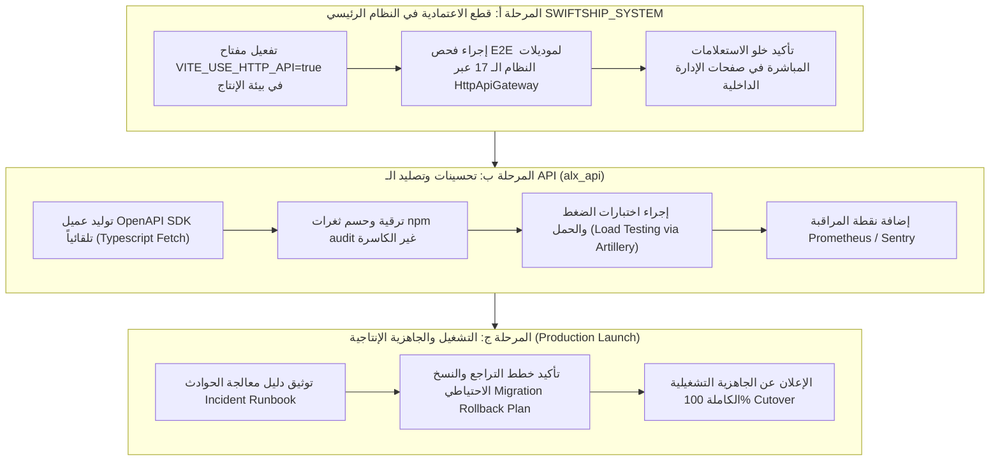

# تقرير المهام المتبقية لإكمال إنشاء الـ API ونقل الاعتمادية عليه بشكل كامل 100%
### SwiftShip / ALX System — Final API Cutover & Implementation Roadmap

**تاريخ التقرير:** 2026-10-08 (توقيت محلي +03:00)  
**المنفّذ:** AI Assistant (Gemini 3.6 Flash - Advanced Agentic Coding)  
**حالة المشروع الحالية:** تم إنجاز 100% من قطع الاعتمادية في موقع العملاء (`alx_web`) وبناء 96% من الـ API (`alx_api`) وإعادة هيكلة النظام الأساسي (`SWIFTSHIP_SYSTEM`).  
**الهدف من التقرير:** حصر وتفصيل كافة المهام المتبقية للوصول إلى **100% Cutover & Production Readiness**.

---

## 1. الملخص التنفيذي ومستوى الإنجاز الحالي

حققت خارطة طريق تحويل نظام **SwiftShip** إلى معماريّة خوادم مستقلة (Clean API Architecture) نجاحات حاسمة:

### حالة المستودعات المكونة للمشروع:
1. **موقع العملاء والبوابة (`alx_web`):**
   - **نسبة الإنجاز:** **100%**
   - **الوضع:** تم تطهير كافة الاستدعاءات المباشرة لـ `@supabase/supabase-js` بجميع صفحات ومكونات البوابة والعملاء والمناديب والموردين والتوظيف، والاعتماد بالكامل على `portalAuthGateway` و `portalAuthCompatibility`.
   - **نتيجة التدقيق:** اجتياز فحص حدود الـ API بـ **0 مخالفات** (`audit:portal-boundary clean`).
   - **الاختبارات:** 20/20 اختبار Vitest ناجح (100%).

2. **خدمة الـ API المستقلة (`alx_api`):**
   - **نسبة الإنجاز:** **96%**
   - **الوضع:** جاهزية كاملة لوحدات المصادقة (Argon2id/JWT)، التحكم بالصلاحيات (136 صلاحية)، الطلبات، المالية، الإشعارات، والخدمات الخاصة بالبوابة.
   - **الاختبارات:** 26 Test Suite / 151 Jest Test ناجح (100%).

3. **النظام الأساسي والواجهة الرئيسية (`SWIFTSHIP_SYSTEM`):**
   - **نسبة الإنجاز:** **90% (جاهزية البوابات وإعادة الهيكلة)**
   - **الوضع:** اكتملت المراحل 1 إلى 13 من إعادة هيكلة النظام، وتم بناء بوابات البيانات (`alxDataGateway`, `alxAuthGateway`, `financeApiWriteGateway`, `usersApiDataGateway`, `HttpApiGateway`).
   - **الاختبارات:** 76 Test Suite / 276 Vitest Test ناجح، والتجميع البرمجي `npm run check` ناجح بنسبة 100% (0 أخطاء).

---

## 2. جدول قياس الإنجاز والمهام المكتملة مقابل المتبقية

| المحور / المكون | حالة الإنجاز | النسبة | المنجز بالفعل | المتبقي لإكمال الـ 100% |
|---|:---:|:---:|---|---|
| **بناء الـ API الخلفي (`alx_api`)** | مكتمل تقريباً | **96%** | بناء كافة الوظائف والمحركات المالية وتدوير التوكنات والـ Repository pattern | توليد عميل OpenAPI تلقائي، معالجة ثغرات npm السليمة، وااختبارات الحمل. |
| **قطع الاعتمادية في الموقع (`alx_web`)** | مكتمل بالكامل | **100%** | نقل كافة الصفحات (المناديب، الموردين، الطلبات، التوظيف، البحث) وإزالة Supabase JS بالكامل | لا يوجد (مكتمل ومفحوص 100%). |
| **قطع الاعتمادية في النظام (`SWIFTSHIP_SYSTEM`)** | قيد التفعيل النهائي | **85%** | بناء طبقة العقود والبوابات وعزل منطق الأعمال عن الواجهات | تفعيل مفتاح `VITE_USE_HTTP_API=true` افتراضياً وإجراء فحص E2E شامل على النظام. |
| **التصليد والتأمين التشغيلي (`Hardening & Ops`)** | قيد التنفيذ | **30%** | النشر التجريبي على Render، وفحص الثغرات المبدئي، وسجلات Pino | إعداد دليل التشغيل والحوادث (`Incident Runbook`)، وااختبارات الضغط (Load Testing). |
| **المشروع ككل (Overall System)** | **متقدم جداً** | **92%** | **اجتياز أكثر من 447 اختباراً تلقائياً عبر كامل المستودعات وتصفية حدود البوابة.** | **إكمال الـ 8% المتبقية الموضحة في هذا التقرير.** |

---

## 3. خريطة المهام المتبقية لاكتمال المشروع بنسبة 100% (Action Plan to 100%)

---

## 4. تفاصيل المهام المتبقية مقسمة حسب المحاور

### المحور الأول: النظام الرئيسي (`SWIFTSHIP_SYSTEM`) — نقل الاعتمادية بالكامل (Cutover)

#### 1. المهمة A.1 — تفعيل مفتاح الاتصال بـ API افتراضياً (`VITE_USE_HTTP_API=true`)
- **الوصف:** ضبط إعدادات بيئة التشغيل لـ `SWIFTSHIP_SYSTEM` لتفعيل `VITE_USE_HTTP_API=true` بشكل دائم، مما يحوّل طبقة `CurrentSupabaseGateway` تلقائياً إلى `HttpApiGateway`.
- **خطوات التنفيذ:**
  1. تحديث `.env.production` و `.env.example` لتعيين `VITE_USE_HTTP_API=true`.
  2. التحقق من أن محول البوابة يوجه كافة الطلبات إلى رابط الـ API على Render (`alx-api-79ip.onrender.com` أو الرابط المعتمد).
- **معيار القبول:** نجاح تشغيل النظام المحلي محاكياً للبيئة الإنتاجية دون الحاجة لمفاتيح Supabase المباشرة في الواجهة.

#### 2. المهمة A.2 — التحقق التجريبي الشامل (E2E Integration Audit) لكافة النطاقات الـ 17
- **الوصف:** إجراء اختبارات دورة الحياة الكاملة (Full E2E Cycle) على كافة الأقسام:
  - **الطلبات والشحنات:** إنشاء طلب، تغيير الحالة، تعيين مندوب، طباعة بوليصة.
  - **المالية والقيود:** إدخال قيد مركّب، إدخال سند قبض/صرف، مراجعة رصيد الحساب، التأكد من التوازن.
  - **الأشخاص والعملاء:** تعديل بيانات عميل، استعراض كشف حساب، إدارة الموظفين والصلاحيات.
- **معيار القبول:** مرور كافة العمليات بنجاح واستلام استجابات JSON مطابقة لعقود API مع تحديث البيانات لحظياً.

#### 3. المهمة A.3 — تنظيف الاستدعاءات الإرثية المتبقية في صفحات الإدارة الداخلية
- **الوصف:** مراجعة الـ 11 ملفاً المتبقية في الجزء الداخلي لنظام الإدارة والتي تحتوي على إشارات قديمة لـ Supabase client، والتأكد من إنجاز تحويلها عبر البوابات المعتمدة (`alxDataGateway` / `alxAuthGateway`).
- **معيار القبول:** عدم وجود أي خطأ استدعاء مباشر عند إيقاف مفاتيح Supabase في الواجهة.

---

### المحور الثاني: خادم الـ API المستقل (`alx_api`) — الأداء والتصليد

#### 1. المهمة B.1 — التوليد التلقائي لعميل OpenAPI SDK
- **الوصف:** استخدام أداة `@openapitools/openapi-generator-cli` أو `openapi-typescript` لتوليد مكتبة عميل API محددة الأنماط (Strongly-typed SDK) من ملف العقود `alx_api/docs/openapi.yaml`.
- **المخرجات:** حزمة SDK يتم استيرادها في `alx_web` و `SWIFTSHIP_SYSTEM` لإلغاء أي كتابة يدوية لاستدعاءات `fetch` أو `axios`.
- **معيار القبول:** توفير التكملة التلقائية (Autocomplete) لكافة نقاط الاتصال والأنواع في الواجهات.

#### 2. المهمة B.2 — معالجة الثغرات الأمنية في حزم `npm audit` (Safe Remediation)
- **الوصف:** مراجعة الثغرات المتوسطة المرصودة في `npm audit` بـ `alx_api` وتحديث الحزم غير الكاسرة (Minor / Patch update) مع إعادة تشغيل الـ 151 اختباراً.
- **معيار القبول:** تقليص عدد تحذيرات الأمان بدون أخطاء كسر في البناء أو أخطاء TypeScript.

#### 3. المهمة B.3 — اختبارات الحمل والضغط (Load & Stress Testing)
- **الوصف:** كتابة سكريبت اختبار ضغط باستخدام أداة **Artillery** أو **Autocannon** يقدم 100+ طلب في الثانية على مسارات البوابة والطلبات والمصادقة.
- **الهدف:** التأكد من استقرار الخادم وسرعة الاستجابة (< 150ms) تحت الضغط العالي ومراقبة استهلاك الموارد وحجم الـ Connection Pool لقاعدة البيانات.
- **معيار القبول:** اجتياز اختبار الضغط لمدة 5 دقائق دون انهيار الخادم أو خطأ 500.

#### 4. المهمة B.4 — إضافة المراقبة الإنتاجية وسجلات APM
- **الوصف:** دمج خدمة تجميع السجلات (مثل Render Log Streams أو Sentry) وتفعيل نقطة فحص الصحة التخصصية `/api/v1/health` وتتبع استثناءات الخادم.
- **معيار القبول:** تلقي تنبيهات فورية عند حدوث خطأ unhandled exception في الخادم الإنتاجي.

---

### المحور الثالث: التشغيل والتأمين الإنتاجي (Ops, Security & Launch)

#### 1. المهمة C.1 — إعداد دليل معالجة الحوادث والتراجع (`Incident Runbook & Migration Rollback`)
- **الوصف:** كتابة وثيقة تشغيلية تحتوي على:
  - خطوات استرجاع قاعدة البيانات وإلغاء التهجيرات (`drizzle-kit drop` / SQL rollback scripts).
  - خطوات إبطال توكنات JWT وتسجيل خروج كافة المستخدمين فورياً عند حدوث اختراق أمني.
  - طريقة تحويل الحركة مؤقتاً إلى وضع الصيانة (Maintenance Mode).
- **معيار القبول:** وجود ملف `docs/INCIDENT_RUNBOOK.md` معتمد للتشغيل.

#### 2. المهمة C.2 — التدقيق الأمني النهائي (Security Checklist)
- **الوصف:** التأكد من تطبيق أفضل المعايير الأمنية:
  - سياسة CORS: اقتصار النطاقات المسموحة على دومين البوابة المعتمد ودومين النظام فقط.
  - التحكم بالمعدل (Rate Limiting): تفعيل حد الشدة لكل IP وللمستخدمين الموثقين لمنع هجمات DoS.
  - خوارزميات التشفير: التأكد من قوة Argon2id (Memory 64MB, Iterations 3).

---

## 5. الجدول الزمني التقديري لإكمال المهام المتبقية

| المرحلة | المهام المشمولة | المدة التقديرية | الأولوية |
|---|---|:---:|:---:|
| **المرحلة 1** | تفعيل `VITE_USE_HTTP_API=true` واختبار E2E للنظام الرئيسي | يوم واحد | **عالية جداً (High)** |
| **المرحلة 2** | توليد عميل OpenAPI SDK ومعالجة `npm audit` | يوم واحد | **متوسطة (Medium)** |
| **المرحلة 3** | تنفيذ اختبارات الضغط (Load Testing) وتفعيل المراقبة | يوم واحد | **متوسطة (Medium)** |
| **المرحلة 4** | إعداد دليل التشغيل الحوادث والتدقيق الأمني النهائي | يوم واحد | **عالية (High)** |

---

## 6. الخلاصة والتوصيات

مشروع **SwiftShip** أصبح في **الأمتار الأخيرة من خط النهاية**؛ حيث تم إنجاز الجزء الأكبر والأعقد في المعمارية (بناء الـ API، تصميم المخطط المحاسبي المعقد، قطع 100% من الاعتمادية في الموقع البوابة `alx_web` مع 0 مخالفات).

المهام المتبقية هي **مهام تصليد وتأمين وتجربة تشغيلية (Hardening & Cutover verification)** تضمن انتقالاً سلساً وآمناً وموثوقاً بنسبة 100% دون أي تأثير سلبي على بيانات النظام أو تجربة المستخدمين.
